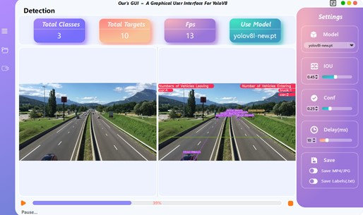
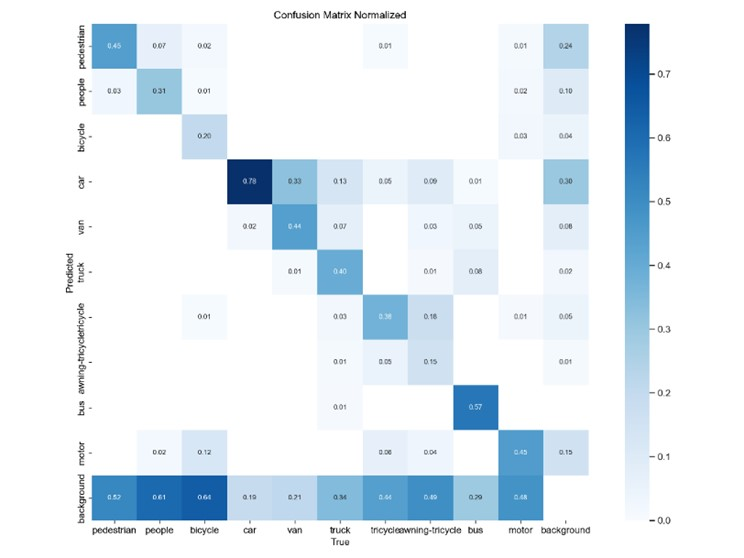
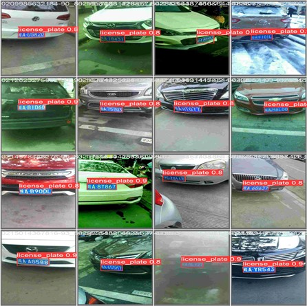

# Yolov8-CountingSpeed-GUI
Deeplearning homework in 2023.7.8
# 0.Overview of our GUI
  
Create a environment:  
In our experiment we use, Python 3.9 with PyTorch 1.12.0 + CUDA 11.6.  
```python  
conda create -n yolov8 python=3.9  
```
```python
conda activate yolov8
```
```python
pip install torch==1.12.0+cu116 torchvision==0.13.0+cu116 torchaudio==0.12.0 --extra-index-url https://download.pytorch.org/whl/cu116
```
```python
pip install -r requirements.txt  
```
# 1.Train model    
  

  

If you are interested in our **Dataset**, please contact us：ouzw5@mail2.sysu.edu.cn  

# 2.How to run
```python
python main.py
```
If you want to detect license image, you need to choose license.pt.  

# 3.Reference  
GUI: [GUI](https://github.com/Jai-wei/YOLOv8-PySide6-GUI)  
Speed: [Speed](https://github.com/MuhammadMoinFaisal/YOLOv8-DeepSORT-Object-Tracking)  
License: [License](https://github.com/MuhammadMoinFaisal/Automatic_Number_Plate_Detection_Recognition_YOLOv8)  
License: [License](https://github.com/ablanco1950/LicensePlate_Yolov8_Filters_PaddleOCR)  
License: [License](https://github.com/we0091234/Chinese_license_plate_detection_recognition)  

